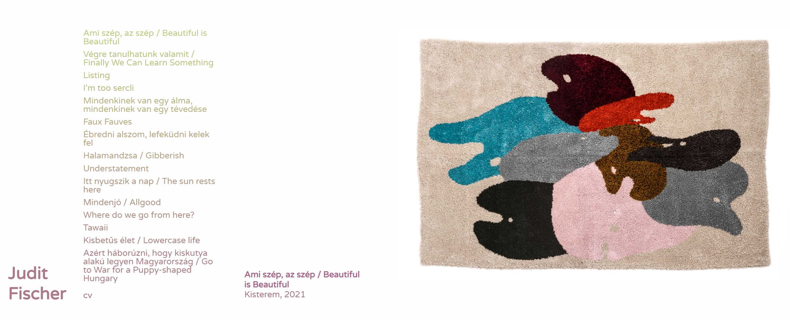
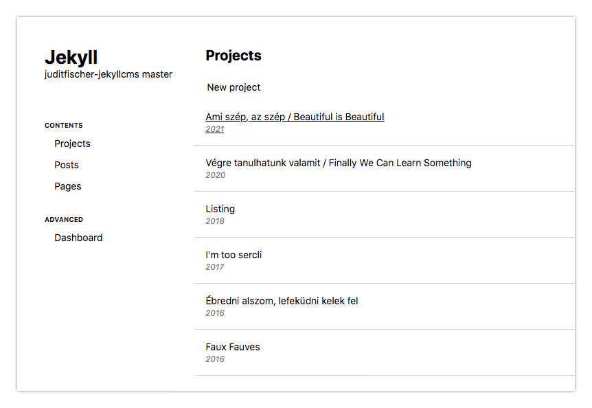

# Judit Fischer's portfolio site with a custom CMS

A simpleportfolio site made for Judit Fischer, built with Jekyll, wthi a custom client side admin.

## Admin
The admin is a custom built VUE application, that directly push changes to the github repo. It makes any other paid services obsolete.

https://user-images.githubusercontent.com/4587642/139461910-9cf774af-a559-415d-84d0-91e20f5e0124.mp4

## TODO
- [x] Projects order
- [ ] SEO
- [ ] Optimize for sharing https://www.siteleaf.com/blog/seo-with-jekyll-siteleaf/

## To host on a domain

create a CNAME file containing the domain
